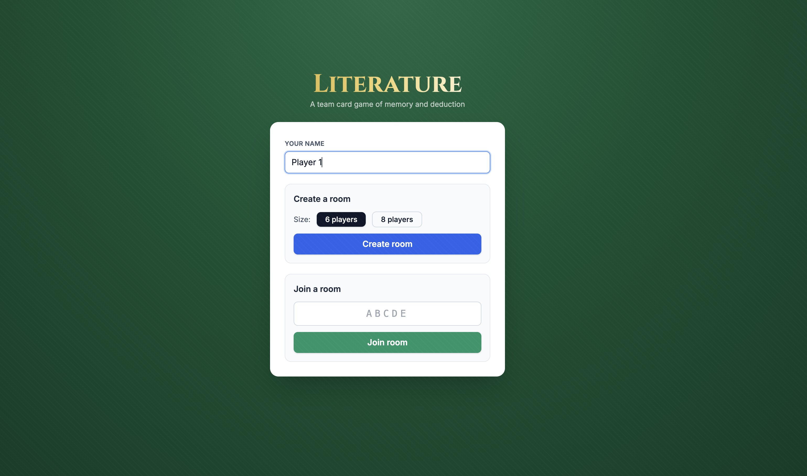
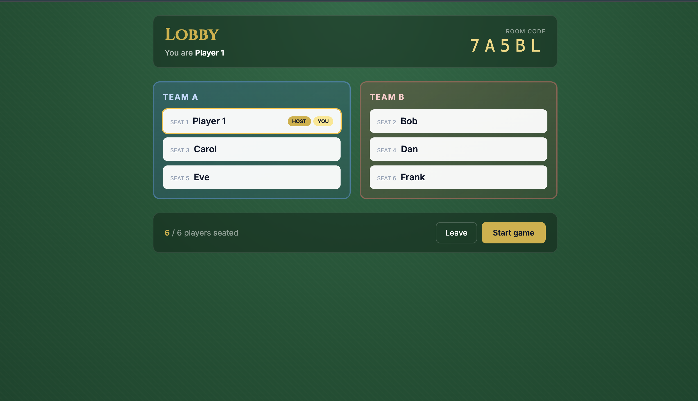
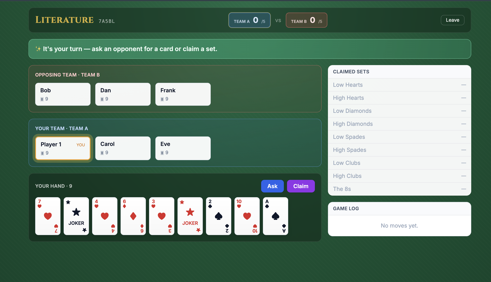
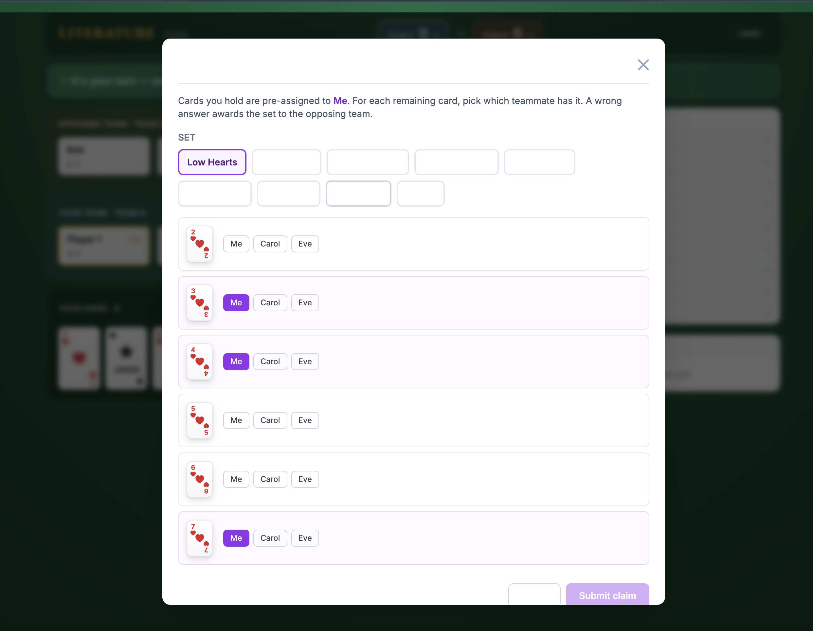
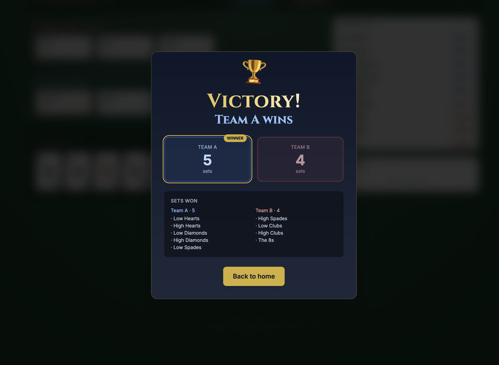

# Literature

A multiplayer web implementation of **Literature** (also known as *Fish*) — a team card game of pure memory, deduction, and teamwork. No luck, no betting; once the cards are dealt the entire game is information.



## Highlights

- **6 or 8 player** support, two alternating teams
- **Real-time** turns over WebSockets — open a tab per player
- **Pure rule engine** with 38 unit tests covering every transition (asks, claims, victory, edge cases)
- **Authoritative server** — clients only see public state + their own hand
- **Felt-table UI** with animated turn indicator, claim auto-fill, and a celebratory victory overlay

## Quick start

Requires Node 18+ and `pnpm`.

```bash
pnpm install
pnpm dev:server   # Socket.IO server on :4000
pnpm dev:client   # Vite dev server on :5173
```

Then open `http://localhost:5173` in **6 (or 8) browser tabs/windows** — each tab is a distinct player (sessions are scoped to `sessionStorage`).

## Game flow

### 1. Home — create or join a room

Pick a name, then either start a new 6/8-player room or paste a 5-letter code from a friend.


### 2. Lobby — fill the seats

Players are auto-assigned to alternating Team A / Team B by seat order. The host (first to enter) sees the **Start game** button once all seats are filled.



### 3. Game — ask, claim, deduce

Each player sees their own hand, opponents' card counts, the public log of every ask, and a side panel of claimed sets.

- **Ask:** pick an opponent → pick a set you hold a card from → pick a specific card you don't have. Success continues your turn; failure passes the turn to the asked player.
- **Claim:** declare you know where all 6 cards of a set are. The dialog **pre-fills cards you hold** to "Me" — you only assign the rest. Wrong claim awards the set to the opposing team.

The active player has a pulsing gold ring; an emerald banner says "It's your turn!" when it's yours.



### 4. Claim a set

Auto-fill assigns your own cards; you only need to place the cards held by teammates.



### 5. Victory

When a team takes 5 sets (or all 9 are claimed), a full-screen celebration shows the winning team, final score, and per-team set breakdown.



## Rules

Full rules with all edge cases live in [RULES.md](RULES.md). Quick summary of the precise turn transitions:

| Event          | Who plays next                                                    |
| -------------- | ----------------------------------------------------------------- |
| Ask succeeds   | Asker keeps the turn                                              |
| Ask fails      | The asked player gets the turn directly                           |
| Claim succeeds | Any non-empty player on the claimer's team — first to act         |
| Claim fails    | Opposing team wins the set; any non-empty opponent — first to act |

Empty-handed players are fully passive: they cannot ask, be asked, or be passed a turn.

## Project layout

```
literature/
├── RULES.md                    Canonical rules + clarifications
├── shared/                     Types shared by server & client
│   └── src/
│       ├── cards.ts            Card, deck construction
│       ├── sets.ts             The 9 sets, set-of-card lookup
│       ├── state.ts            GameState, public-state filter
│       ├── events.ts           Engine actions, EngineError
│       └── socket-events.ts    Wire protocol
├── server/
│   ├── src/
│   │   ├── engine/             Pure game logic + unit tests
│   │   ├── rooms/              In-memory room manager
│   │   ├── sockets/            Socket.IO event handlers
│   │   └── index.ts            Express + Socket.IO bootstrap
│   └── scripts/smoke.ts        Multi-client end-to-end smoke test
└── client/
    ├── src/
    │   ├── pages/              Home, Lobby, Game
    │   ├── components/         Card, Ask/ClaimDialog, EventLog, VictoryOverlay
    │   ├── store.ts            Zustand store + Socket.IO client
    │   └── App.tsx             Router + state-driven navigation
    └── tailwind.config.js      Custom keyframes (pulse-ring, confetti, shimmer)
```

## Development

```bash
pnpm --filter @literature/server test          # 38 engine unit tests
pnpm --filter @literature/server build         # type-check server
pnpm --filter @literature/client build         # type-check + bundle client

# End-to-end smoke (server must be running):
pnpm --filter @literature/server exec tsx scripts/smoke.ts
```

The smoke script spins up 6 socket clients, creates a room, has 5 of them join, starts the game, and prints the per-player view — useful for verifying the wire protocol after server changes.

## Tech stack

- **Engine:** TypeScript, immutable state transitions, vitest
- **Server:** Node + Express + Socket.IO
- **Client:** React 18, Vite, Tailwind CSS, Zustand, React Router
- **Monorepo:** pnpm workspaces (`shared`, `server`, `client`)
